# Turn Of Month Trading Strategy Simulation on Nifty and Nifty Next 50 Index in the Indian Stock Market

## Introduction

One interesting anomaly found is the financial markets is that the return on investments are higher at the transition of a trading month. This interesting seasonality is popularly know as the "turn of month". Through this project I, try to simulate and analyze the effectiveness of this seasonal trading strategy when we invest based on the Nifty 50 and Nifty Next 50 Index in the Indian Stock Market. Aditionally we also experiment to see the difference in performance between equal weighted portfolio and Index based weighted portfolio.

## Data

At first I manually recreated India's trading calendar from 2009 to 2024 from [investing.com](https://in.investing.com/holiday-calendar/) and other news articles. I also included a section of special holidays which either are originally holidays due to special events like elections or have special trading sessions.

Secondly I reconstructed the Nifty 50 and Nifty Next 50 Index downloading the data from [niftyindices.com](https://www.niftyindices.com/). After which I procedded to download the equity values of data from 2 different sources: [YahooFinance](https://finance.yahoo.com/) for actively stocks and from [nseindia.com](https://www.nseindia.com) for delisted stocks. I also had to manually create a mapping file to identify companies that have been delisted or name changed or merged.

## Trading Strategy

> We Take Entry on the last trading day of the month and exit on the third trading day of the month.

## Simulation

First I marked the entry and exists for each of the securities and then pulled the data sliced it ready for back testing. We create five data frames one each to mark the entry, exit, open price, close price for each  and the weightage for equity. We use VectorBT for back testing.

One important consideration I had to make was that I did not simulate any trades during the end of March, 2019 as there is no data available.

Also, currently the fees for the simulation is zero.

## Configuration

    Initial Cash = 500000 INR.
    All Stocks Grouped Together and cash shared.
    For equal weighted portfolio we have a size of 0.02 or 2% of the portfolio or a minimmum of 1 share which ever is higher.
    For Index weighted we follow the weightage baed on index or a minimmum of 1 share which ever is higher.

## Results

| Portfolio Based On            | Sharpe Ratio  | Omega Ratio | Sortino Ratio | Max Drawdown [%] | Annualized Return [%] | Annualized Volatility [%] |
| :-------------------------    | :----------:  | :---:       | :------:      | :------:         | :------:              | :------:                  |
| Nifty 50  Equal Weighted      |   0.844       | 1.265       |   2.677       |  -12.96          | 15.21                 | 8.95                      |
| Nifty 50  Index Weighted      |   0.517       | 1.182       |   2.236       |  -13.42          | 11.64                 | 8.40                      |
| Nifty Next 50  Equal Weighted |   1.594       | 1.333       |   3.483       |  -20.61          | 27.50                 | 11.24                     |
| Nifty Next 50  Index Weighted |   1.200       | 1.234       |   2.733       |  -26.78          | 22.78                 | 11.85                     |

We observe that an equal weighted portfolio based on Nifty Next 50 Index performs best in terms of annualized returns when trading the Turn of Month Strategy.

The major drawdowns one observes accross all experiments is during the 2018-2020 period for the following two consecutive events:

1) The economic slowdown witnessed in India during 2018-2020 along with other econmic problems like the PNB Bank Scam, NPAs in banks, etc.
2) Covid19 correction that happened during the March to May 2020.

### Nifty 50 Equal Weighted Portfolio Turn Of Month Strategy

#### Value

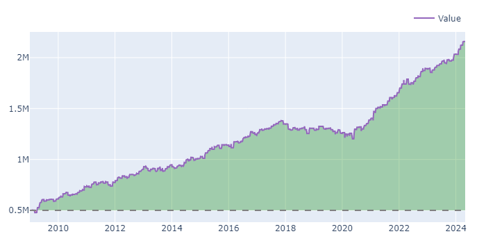

#### Drawdowns

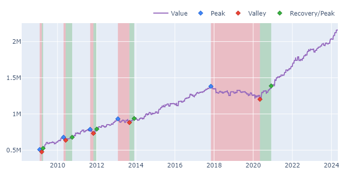

#### Underwater

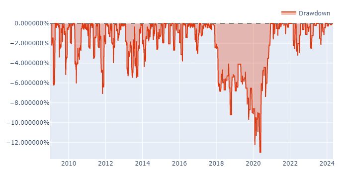

### Nifty 50 Index Weighted Portfolio Turn Of Month Strategy

#### Value

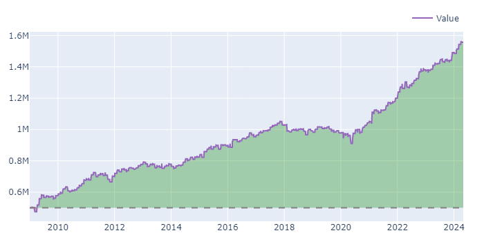

#### Drawdowns

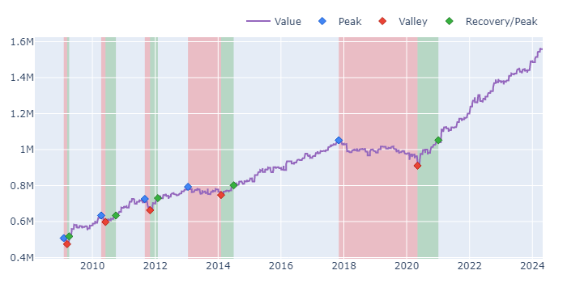

#### Underwater

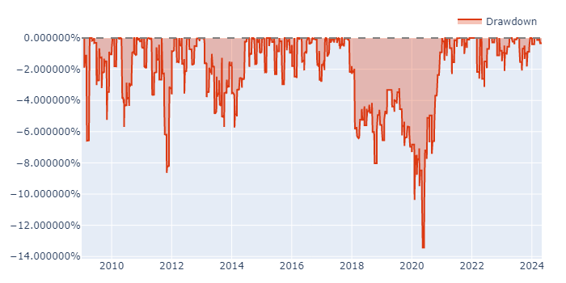

### Nifty Next 50 Equal Weighted Portfolio Turn Of Month Strategy

#### Value

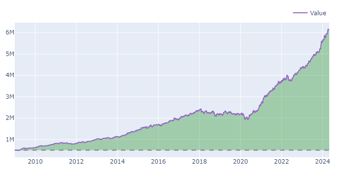

#### Drawdowns

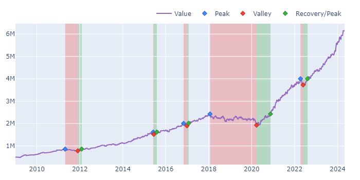

#### Underwater

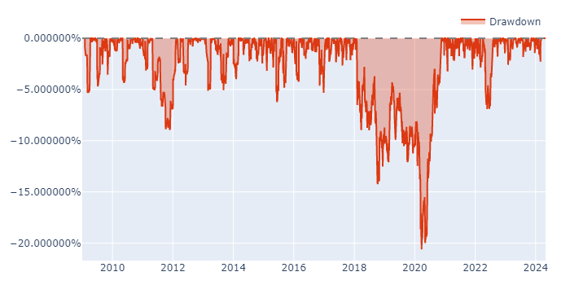

### Nifty Next 50 Index Weighted Portfolio Turn Of Month Strategy

#### Value

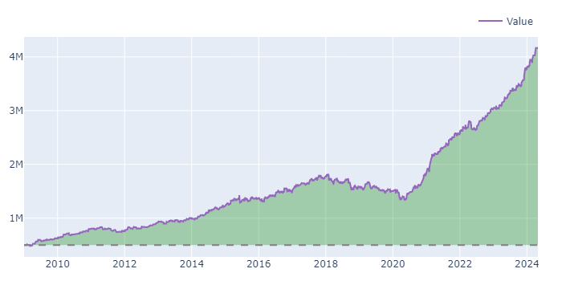

#### Drawdowns

#### Underwater

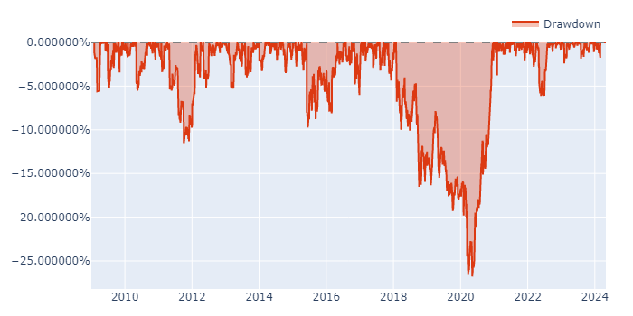

## Code

    1)  build_trading_calendar.py: To Build the Trading Calendar from the Holidays file: IndiaTradingHolidays.csv present at data/master.
    2)  download_historical_reports.py: To Download Nifty 50 and Nifty Next 50 reports that contain Market Cap., Weightage, and Beta.
    3)  data_collate_nifty50.py: Script to collate Nifty 50 reports into a single file.
    4)  data_collate_nifty_next50.py: Script to collate Nifty Next 50 reports into a single file.
    5)  data_prep_nifty50.ipynb: Prepares the Nifty 50 Data for simulation of turn of month strategy.
    6)  data_prep_nifty_next50.ipynb: Prepares the Nifty Next 50 Data for simulation of turn of month strategy.
    7)  sim_ew_nifty50.ipynb: Performs Simulation of turn of month strategy on Nifty 50 Index stocks in an Equal Weighted Portfolio.  
    8)  sim_iw_nifty50.ipynb: Performs Simulation of turn of month strategy on Nifty 50 Index stocks in an Index Weighted Portfolio.
    9)  sim_ew_nifty_next50.ipynb: Performs Simulation of turn of month strategy on Nifty Next 50 Index stocks in an Equal Weighted Portfolio.
    10) sim_iw_nifty_next50.ipynb: Performs Simulation of turn of month strategy on Nifty Next 50 Index stocks in an Index Weighted Portfolio.

## Notes

1) Buy on Open and Sell on Close.
2) We have Nifty 50 Data and Nifty Next 50 Data missing for the months of Sep 2020 and May 2018. This data is recreated from other monthly reports from [niftyindices.com](https://www.niftyindices.com/). The files are included in the additional_files folder.
3) Yahoo Missing Data for dates:
    1) 2019-02-13 (Wednesday)
    2) 2019-03-29 (Friday) required day for Turn of Month Strategy hence no simulation between 15th March, 2019 and 15th April, 2019.
